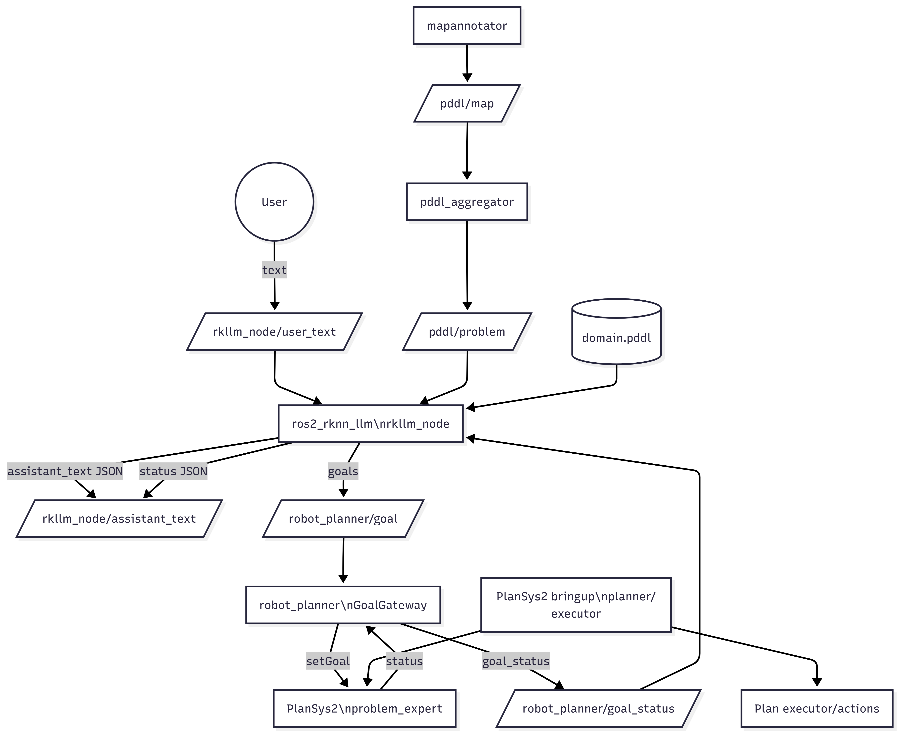

# Robot Orchestrator Workspace Bundle

This folder aggregates the core packages required to run the robot LLM planner stack on CM3588 and companion hosts. It is intentionally not a ROS package; it is a curated bundle of related packages that are built together in the same workspace.

## Contents

- `robot_planner` - Planning, PDDL aggregation, and PlanSys2 integration (goal gateway + action nodes).
- `ros2_rknn_llm` - RKLLM-based ROS 2 node that turns user requests into structured actions.
- `robot_llm_orchestrator` - Launch orchestration for planner + LLM.
- `mapannotator` - Provides `/pddl/map` (problem template) used by `pddl_aggregator`.
- `rc_agent` - Auxiliary robot agent utilities.
- `plansys2_upf_plugin` - PlanSys2 plugin dependencies.
- `gscam2`, `ros-gst-bridge` - Optional vision streaming components.

## Build

From the workspace root:

```bash
cd ~/ros2_ws
colcon build --symlink-install
source install/setup.bash
```

If you only want the core stack:

```bash
colcon build --packages-select robot_planner ros2_rknn_llm robot_llm_orchestrator
```

## Run

Launch the full stack (planner + PlanSys2 + LLM):

```bash
ros2 launch robot_llm_orchestrator robot_llm_orchestrator.launch.py \
  model_path:=$HOME/qwen3-vl-4b-instruct_w8a8_rk3588.rkllm
```

Key topics:

- `/rkllm_node/user_text` - User input text
- `/rkllm_node/assistant_text` - Structured JSON replies
- `/pddl/problem` - Aggregated problem PDDL
- `/robot_planner/goal` - Goals pushed to PlanSys2
- `/robot_planner/goal_status` - Goal accept/reject status

## Troubleshooting

- If `/pddl/problem` is empty, ensure `mapannotator` publishes `/pddl/map`.
- If PlanSys2 fails with PDDL parse errors, check the domain requirements (e.g., `:numeric-fluents`).
- If RKLLM fails to allocate NPU memory, ensure no stale `rkllm_node` processes are running.

## Notes

- This folder is a convenience bundle, not a standalone ROS package.
- Use consistent `ROS_DOMAIN_ID` and `RMW_IMPLEMENTATION` across machines for DDS discovery.

## Node Interaction Graph


